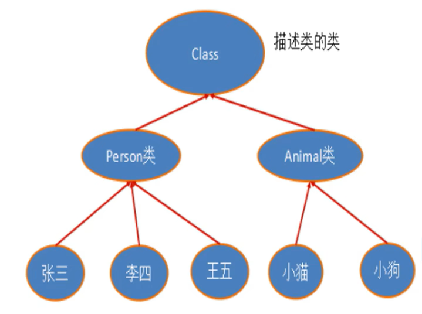

### 反射
要点
- 一个类在内存中只有一个Class对象实例
- 一个类被加载后，类的整个结构都会被封装在Class对象中
- java.lang.Class代表一个类，每个类加载后，就会以Class为模板，创建一个Class实例
- 如图


### Spring常用依赖
```xml
<dependency>
     <groupId>org.springframework</groupId>
     <artifactId>spring-webmvc</artifactId>
     <version>6.0.5</version>
</dependency>
```
### 使用注解需要context约束
```xml
<?xml version="1.0" encoding="UTF-8"?>
<beans xmlns="http://www.springframework.org/schema/beans"
       xmlns:xsi="http://www.w3.org/2001/XMLSchema-instance"
       xmlns:context="http://www.springframework.org/schema/context"
       xsi:schemaLocation="http://www.springframework.org/schema/beans
        https://www.springframework.org/schema/beans/spring-beans.xsd
        http://www.springframework.org/schema/context
        https://www.springframework.org/schema/context/spring-context.xsd">
<!--    开启注解的支持-->
    <context:annotation-config/>
</beans>
```

### @Component写在类名上面，等价于
```xml
<bean id ="user" class = "com.xfp.pojo.User"/>
```
#### 此外@Component注解还有四个衍生注解@Repository @Sevice @Controller 
它们的作用都一样，按照MVC三层架构分层，都代表把类注册到spring中，装配bean
#### @Scope("")和@ScopeName("") 可以设置作用域，设置单例模式和原型模式

## 疑惑
``
@Component、@Configuration、@Bean的关系
``
### 使用纯java配置bean有两种方式，首先都要建立config.java文件，并添加@Configuration注解
#### 方法一：申明方法，并在方法前加上@Bean注解，获取类的实例
```
@Bean
public User getUser(){
        User user = new User();
        user.setName("xfp大王");
        return user;
    }
```
#### 在测试阶段，使用```getBean("getUser")```
#### 方法二：在实体类上面加上@component注解，并在config.java文件中配置扫描
#### 在@Configuration下面添加@ComponentScan("com.xfp.pojo")
#### 在测试阶段使用```getBean("user")```


## AOP
### 代理模式``代理模式是springAOP的核心``
``代理模式是对代理类对被代理类的功能拓展；装饰器模式是对原本对象的功能的增强``
#### 静态代理
好处：可以使真实角色的操作更纯粹，不用关注公共业务；公共业务交给代理角色，实现业务的分工；业务拓展时，方便集中管理；

缺点：一个真实角色就会产生一个代理（解决办法：反射）
#### 动态代理

- 动态代理和静态代理的角色一样

- 动态代理的代理类是动态生成的，不是直接写好的

- 动态代理分为**基于接口**的和**基于类**的
- 基于接口---JDK动态代理
- 基于类-----cglib
- java字节码实现：javassist

**两个类** Proxy 和 InvocationHandler

**InvocationHandler**:接口，在反射包下面，是由代理实例的代理类实现的接口，
当调用代理实例上的方法时，方法调用将被编码并分配到其调用处理程序的invoke()（用反射的方式实现一个方法）方法

**Proxy**：提供创建动态代理类和实例的静态方法

