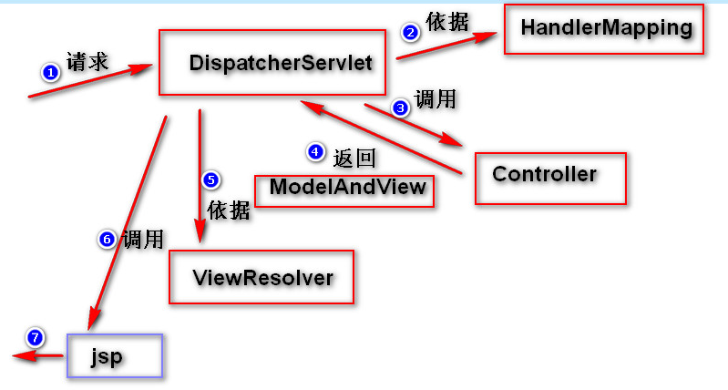

### SpringMVC流程图

解释

====================================================

 
- 注解开发web流程

@Component、@Repository、@Sevice、@Controller
它们注册到spring容器的作用都一样，按照MVC三层架构分层

### Restful风格
- 使用@PathVariable注解让参数的值绑定到一个URL模板变量上面,例如localhost:8080/hello?a/b
- 使用getMapping

### 乱码问题
- 过滤器org.springframework.web.filter.CharacterEncodingFilter解决了字符乱码
- json乱码使用